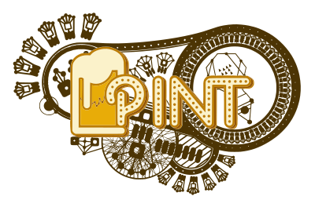

  

## A Polkadot ecosystem index for investors. A self-sustaining auction treasury for parachains.

The Polkadot Index Network Token (PINT) is a token that enables protocols and individuals to easily gain diversified exposure to the top Polkadot ecosystem projects. Holders are exposed to the price movements and rewards of all of the assets within the PINT index. 
While many people (even the professionals) believe they should actively manage their portfolios, investing in an index is the best choice for most investors - just ask Warren Buffet. Index funds are popular because they enable ownership of a wide variety of assets, providing immediate diversification and lower risk. 

PINT operates as a DAO within the StakerDAO ecosystem, governed by a council of Polkadot ecosystem participants.

| Council Members                                                   | Company                   |
|-------------------------------------------------------------------|---------------------------|
| Ruitao Su, Co-Founder & CEO                                       | Acala & Laminar           |
| Xiao Xiao, Investment Manager                                     | HashKey Capital           |
| Jack Platts, Co-Founder & CEO                                     | Hypersphere Ventures      |
| Benjamin Weiss, Substrate Builders Program                        | Parity Technologies       |
| Ben Perszyk, Head of Portfolio Ops,  Polkadot Ecosystem Fund Lead | Polychain Capital         |
| Graham Tonkin, Co-Founder                                         | Stateless.Money Validator |
| Open Seat for PINT Community Member                               |                           |

One of the key features of the Polkadot ecosystem is the ability for projects to build use-case-specific "parachains". Parachains are self-sovereign blockchains that can interoperate with one another while benefiting from the security of the base Polkadot relay chain. This interoperability creates a commonwealth of sorts, providing unique benefits to projects building within the Polkadot ecosystem.
‌The Polkadot relay chain abstracts away many of the technical complexities present when building "stand-alone" blockchains. Similar to how Amazon Web Services removed the need for individual companies to maintain a rack of servers and the staff to support them in each office, the Polkadot relay chain removes the necessity to employ cryptographers, runtime engineers, and protocol-level specialists. This enables parachains to focus on their core use-case and govern by their own rules, while the relay chain remains optimized to secure and settle the network.
One hundred parachain slots will be available for parachain candidates to compete for via the Parachain Lease Offering (PLO) process. Each prospective parachain candidate must generate sufficient financing to secure the slot and maintain the lease on an ongoing basis. Additionally, many of the parachains will be managed via a permissionless and transparent “on-chain” governance process. This model creates a challenge for parachain communities which may impact the stability and growth of the Polkadot ecosystem:

***Treasury Management*** - Communities will need to consider how the funds held in their treasury are managed. If a protocol holds only their native asset, the risk of volatility may impact the long-term viability of their parachain slot or ability to finance ongoing development. While the relay chain enables them to focus on their core business case, not all projects will have the expertise or desire to actively manage the funds held in their treasury. 
***Ongoing PLO Financing*** - Parachains may find it difficult to maintain their slot for sustained periods of time (e.g after the 4th auction) once token treasuries are depleted from airdrops and when competing with new, more speculative projects that have significant marketing budgets.

PINT will enable any person or protocol to gain diversified exposure to the top projects in the Polkadot ecosystem in a transparent and permissionless way. Protocols approved to join the index by PINT governance will benefit from; 

***A reduction in treasury risk*** - Each protocol community may choose to exchange a portion of their treasury for PINT, an index that consists of the top projects in the ecosystem, governed by reputable ecosystem professionals. This reduces the need for active treasury manangement.
Ensuring governance quorums are met - The PINT council will participate in the governance of assets in the index.
***PLO Financing*** - Constituent communities will have the ability to apply for financing from the PINT treasury.
Increased token demand - Investors looking to gain diversified ecosystem exposure will increase the demand for tokens in the index.

***PINT Docs*** is an evolving set of documents and resources to help you understand PINT, the Polkadot ecosystem, and how to build and interact with PINT. 

- If you are already familiar with PINT and the Polkadot ecosystem, or you just want to dive in, head over to [Get Started](/getting-started/installation).

## Connect

Let us know if you have any feedback or ideas that might help us improve our documentation or if you have any resources that you would like to see added. If you are planning to use PINT or any of the PINT pallets, please say hello!

## [Installation](https://github.com/ChainSafe/PINT/blob/db/docs/docs/getting-started/installation.md)

## [Architecture](https://github.com/ChainSafe/PINT/blob/matt/more-docs/docs/architecture.md)
